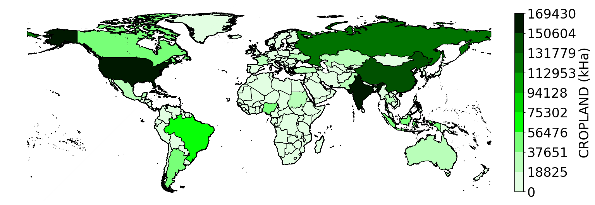

## FAOSTAT Census Data




We use [FAOSTAT data for Land Use](https://www.fao.org/faostat/en/#data/RL) as our base samples before fusion with subnational census data. In particular, we choose the following settings:

* COUNTRIES: 
  * ```All```

* ELEMENTS: 
  * ```Area```

* ITEMS: 
  * CROPLAND -> ```Arable land``` + ```Land under permanent crops```
  * PASTURE -> ```Land under perm. meadows and pastures```

* YEARS:
  * ```2013``` - ```2017```

The output csv could also be found under [FAOSTAT_data](./FAOSTAT_data_11-14-2020.csv). The raw FAOSTAT census data maps for both cropland and pasture are shown in the figures above for illustration. We also include another csv [FAOcountryProfile](./FAOcountryProfileUTF8_withregions.csv) for code and name matching in the pipeline.

