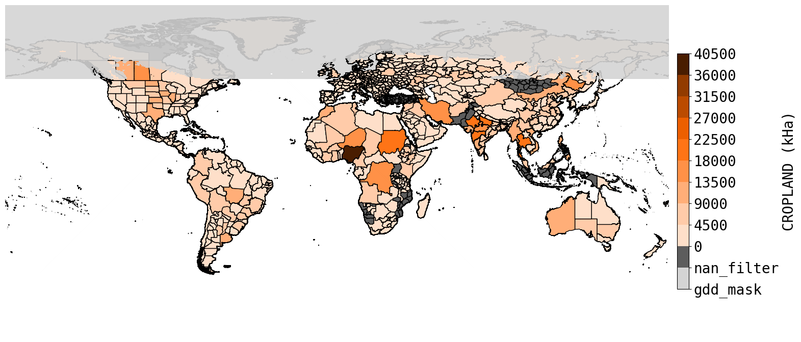
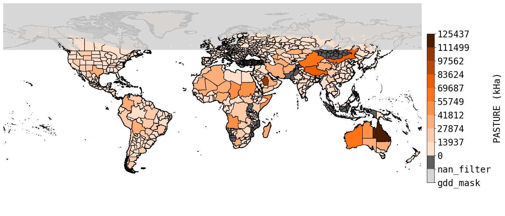

## Global Agricultural Lands in the year 2015
This project is a continuation and update in methodology of the work from [Ramankutty et al. (2008)](https://agupubs.onlinelibrary.wiley.com/doi/full/10.1029/2007GB002952), where we combine subnational level census data and FAOSTAT to develop a global spatial dataset of croplands and pastures on a graticule of 5 arcminutes (~10 $km^2$ at the equator) for supporting a huge variety of research topics, from land use, food security to climate change and biodiversity loss. This repo includes a full set of replicable code for reproduction, modification and testing.

### Data Sources and Processing
- [FAOSTAT](FAOSTAT_data/README.md)
- [Subnational Census](subnational_stats/README.md)
- [GDD](gdd/README.md)
- [Land Cover](land_cover/README.md)

### Results and Analysis
- [Evaluation](evaluation/README.md)
- [Experiments](experiments/README.md) 

### Requirements
- Option 1 - PIP
  - pip install [requirements.txt](requirements.txt) 
- Option 2 - Docker
  - [Dockerfile](Dockerfile)

### Merged Census Input
We merge subnational census data and FAOSTAT to generate the input dataset for our machine learning model. During the merging process, 2 filters are applied, namely NaN filter and GDD filter. The definition of each is shown below. 
* NaN filter
  * Remove samples with NaN in either CROPLAND or PASTURE attribute
* GDD filter 
  * Remove samples that geographically lay in GDD mask

For the data sources we used, originally we have 950 samples after merging, then NaN filter removes 181 samples, and GDD filter removes 42 samples, resulting in a total of 727 samples at the end of the census pipeline (Note: this is not the final input dataset, outliers that have CROPLAND and PASTURE sum greater than 100% will also be removed prior training). Implementation details could be found [here](./utils/process/census_process.py). To run the census pipeline, adjust the yaml files in the ```/configs``` and do:
```
python census.py
```
A visualization of the census inputs is also provided below. 



### Train
All training related configs could be found under ```/configs/training_cfg.yaml```. Note that one could also enable feature selection by specifying features to be removed. Removing a feature in land cover type does not simply remove it, instead a factor of 1/(1-[removed_class_sum]) is applied to the remaining features to maintain the property of probability distribution. All implementation details could be found [here](./utils/process/train_process.py). We use a gradient boosting tree with cross-validation as our model, and to start training, run:
```
python train.py
```

### Deployment
During deployment, we use 20 x 20 block matrices as inputs for our model (detailed process is explained under [Prediction Input and Aggregation](./land_cover/README.md#prediction-input-and-aggregation)). Deployment configs could be modified under ```/configs/deploy_setting_cfg.yaml```, but needs to be consistent with the settings used for trained model, and the post processing implementation is [here](./utils/process/post_process.py). To run deployment to get the final agland map, run:
```
python deploy.py
```

### Citation
```
```


