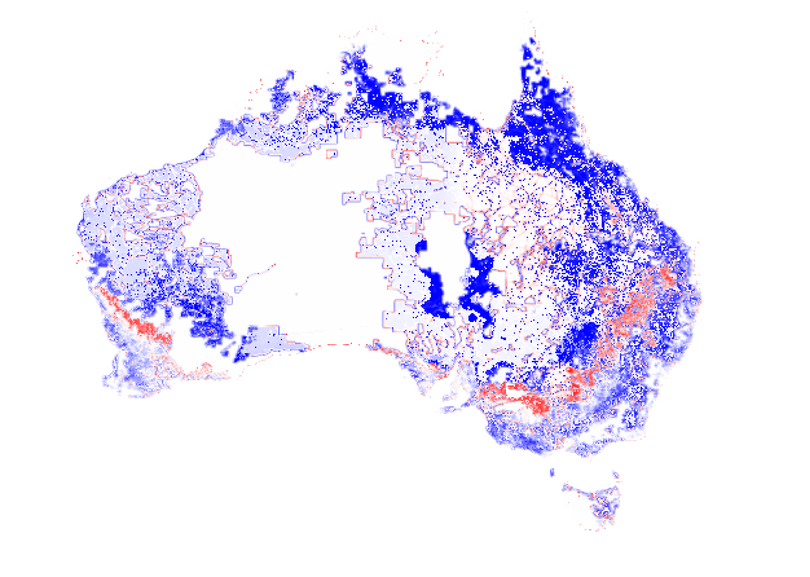
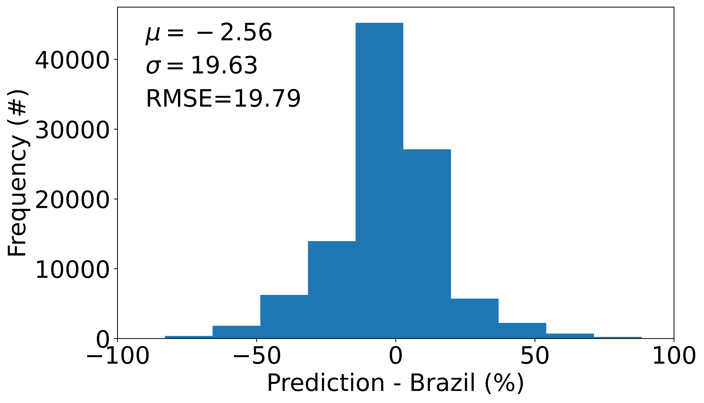
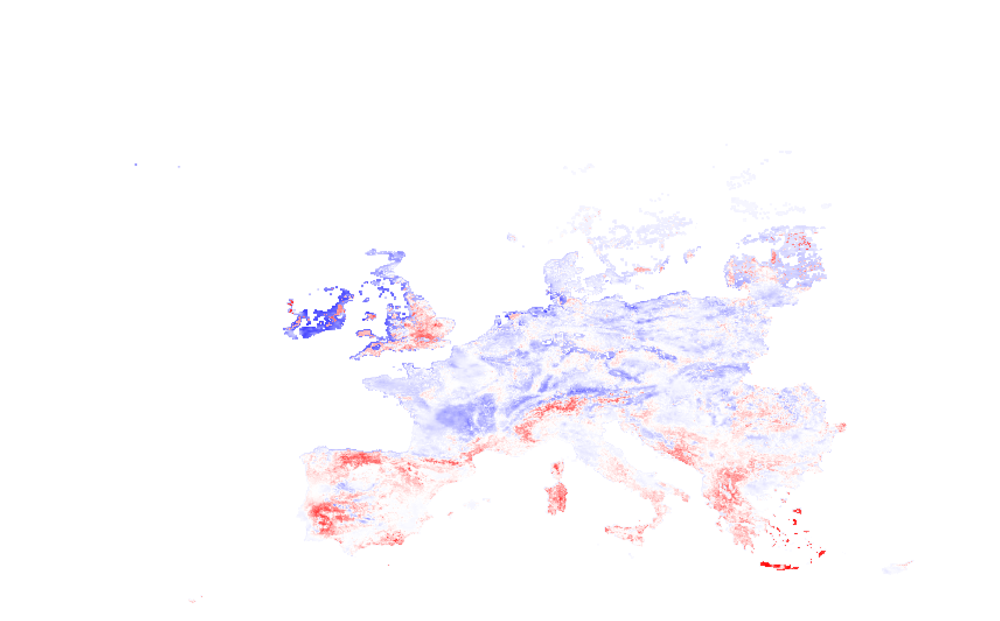
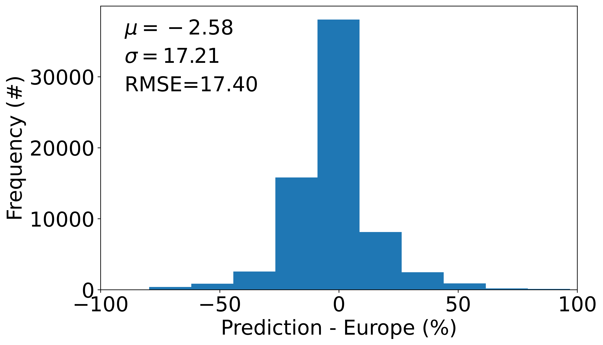
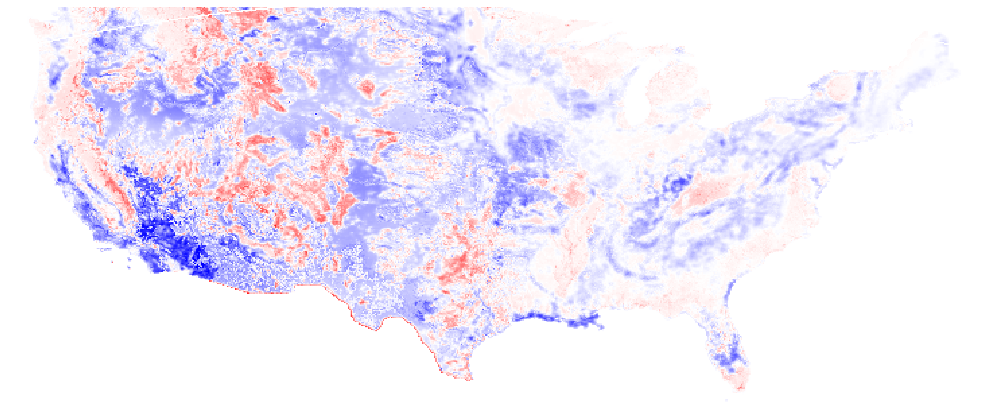
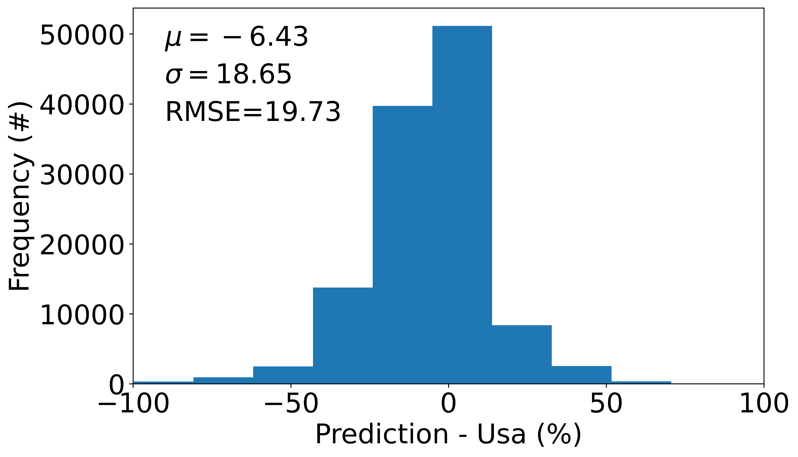

## Evaluation

Due to limitation on current available references, we use different products to evaluate our output cropland and pasture map seperately. 

### Cropland 
#### GeoWiki
One of the references we used for cropland validation is from this [paper](https://www.nature.com/articles/sdata2017136), and their data can be downloaded from [here](https://doi.pangaea.de/10.1594/PANGAEA.873912). In the GeoWiki cropland product, each individual point has a % cropland estimate over a span of time stamps. The basic process is to reproject the lattitude and longitude coordinates of these points to indices form based on the resolution in our final product using nearest neighbors, then extract the raster data points for comparison. Note that since our final product has water-body masks and GDD masks applied, points located in the mask regions are not included in the evaluation. Detailed implementation could be found [here](./cropland_eval_geowiki.py). Specifically, we have a total of 35866 unique sample points in GeoWiki cropland, with 1156 points getting masked out, leaving a total of 34710 samples at the end. 

Temporal-averaged GeoWiki scatter plot and mask-removed points are shown in the two figures below. 

Now we show the GeoWiki and output cropland product difference maps and their histograms for all the experiments we did in the [experiment section](../experiments/README.md).

##### *all_correct_to_FAO_scale_itr3_fr_0*

| iter 0                                                                                                                                          | iter 1                                                                                                                                          | iter 2                                                                                                                                          | iter 3                                                                                                                                          |
| ----------------------------------------------------------------------------------------------------------------------------------------------- | ----------------------------------------------------------------------------------------------------------------------------------------------- | ----------------------------------------------------------------------------------------------------------------------------------------------- | ----------------------------------------------------------------------------------------------------------------------------------------------- |
|   |   |   |   |
|  |  |  |  |

##### *all_correct_to_subnation_scale_itr3_fr_0*

| iter 0                                                                                                                                                      | iter 1                                                                                                                                                      | iter 2                                                                                                                                                      | iter 3                                                                                                                                                      |
| ----------------------------------------------------------------------------------------------------------------------------------------------------------- | ----------------------------------------------------------------------------------------------------------------------------------------------------------- | ----------------------------------------------------------------------------------------------------------------------------------------------------------- | ----------------------------------------------------------------------------------------------------------------------------------------------------------- |
|   |   |   |   |
|  |  |  |  |

As we can see from the figures above, for all experiments, as number of iteration goes up, the difference between GeoWiki and predicted cropland output becomes smaller. However, when we compare the "all correct to FAO" and "all correct to subnation" cases, the difference between the two is also minimal. This likely means GeoWiki cropland is neither closer to FAO data nor subnational data, might be somewhere in between.

#### Maryland
Another reference we used for cropland validation is Maryland cropland for 2015, which could be found [here](https://glad.umd.edu/dataset/croplands). Unlike GeoWiki cropland data, Maryland cropland data provides % cropland values in all pixels globally. Since the  original merged data is in 3km resolution, we reproject the Maryland cropland map to match the geo-transform used in our final product using nearest neighbors. Again, we ignore the regions cropped by the masks. 

Below shows the raw Maryland cropland map. 

##### *all_correct_to_FAO_scale_itr3_fr_0*

| iter 0                                                                                                                                             | iter 1                                                                                                                                             | iter 2                                                                                                                                             | iter 3                                                                                                                                             |
| -------------------------------------------------------------------------------------------------------------------------------------------------- | -------------------------------------------------------------------------------------------------------------------------------------------------- | -------------------------------------------------------------------------------------------------------------------------------------------------- | -------------------------------------------------------------------------------------------------------------------------------------------------- |
|   |   |   |   |
|  |  |  |  |

##### *all_correct_to_subnation_scale_itr3_fr_0*

| iter 0                                                                                                                                                         | iter 1                                                                                                                                                         | iter 2                                                                                                                                                         | iter 3                                                                                                                                                         |
| -------------------------------------------------------------------------------------------------------------------------------------------------------------- | -------------------------------------------------------------------------------------------------------------------------------------------------------------- | -------------------------------------------------------------------------------------------------------------------------------------------------------------- | -------------------------------------------------------------------------------------------------------------------------------------------------------------- |
|   |   |   |   |
|  |  |  |  |

Quite interestingly, in this case, for all experiments, as we increase the number of iterations (and converging to the input dataset), the difference between output and Maryland cropland actually gets larger. Similar to the GeoWiki case, this likely shows Maryland cropland map also stays somehwere in between FAO and subnational census. 

### Pasture 
For pasture, there are no independent global-scale maps from circa 2015 which we could use as a comparison for our final product. As such, we evaluate our pasture product by using land use products containing pasture information in three key regions: Australia, Brazil and the USA.

1. As a pre-processing step, we applied a scaling factor to all subnational data to scale the national totals to match FAOSTAT (all_correct_to_FAO_scale)
2. We used the subnational data for all countries without applying any scaling factors (all_correct_to_subnation_scale)

For each of these experiments, we have 4 different products. We either did 0, 1, 2, or 3 iterations of bias-correction with the model output product, to bias-correct the results back to FAOSTAT totals. 

#### Australia

The reference data that we use for Australia is the [Land use of Australia 2015-16](https://www.agriculture.gov.au/abares/aclump/land-use/land-use-of-australia-2010-11_2015-16). The product is a raster of 250 m resolution, with cell values corresponding to land use types. Certain land use types correspond to pasture. Thus, to pre-process this product for our comparison, we calculate the proportion of "pasture" cells in an aggregate grid cell of 10 km x 10 km. We crop and project our prediction map to match this reference map, and we apply the water body mask (there is no need to apply the GDD mask).

The reference map looks like:

Note: there were multiple land cover definitions that are of interest:

* 210 - Grazing native vegetation
* 320 - Grazing modified pastures
* 420 - Irrigated pastures

The comparisons look like:

##### *all_correct_to_FAO_scale_itr3_fr_0*

| iter 0                                                                                                                                                    | iter 1                                                                                                                                                    | iter 2                                                                                                                                                    | iter 3                                                                                                                                                    |
| --------------------------------------------------------------------------------------------------------------------------------------------------------- | --------------------------------------------------------------------------------------------------------------------------------------------------------- | --------------------------------------------------------------------------------------------------------------------------------------------------------- | --------------------------------------------------------------------------------------------------------------------------------------------------------- |
|  |  |  |  |
|      |      |      |      |

##### *all_correct_to_subnation_scale_itr3_fr_0*

| iter 0                                                                                                                                                                | iter 1                                                                                                                                                                | iter 2                                                                                                                                                                | iter 3                                                                                                                                                                |
| --------------------------------------------------------------------------------------------------------------------------------------------------------------------- | --------------------------------------------------------------------------------------------------------------------------------------------------------------------- | --------------------------------------------------------------------------------------------------------------------------------------------------------------------- | --------------------------------------------------------------------------------------------------------------------------------------------------------------------- |
|  |  |  |  |
|      |      |      |      |

#### Brazil

The reference data that we use for Brazil is from [Mapbiomas](https://storage.googleapis.com/mapbiomas-public/brasil/collection-6/lclu/coverage/brasil_coverage_2015.tif). The product is a raster of 30 m resolution, with cell values corresponding to land use types. We are particularly interested in those related to pasture. Based on the [legend](https://mapbiomas-br-site.s3.amazonaws.com/downloads/Colecction%206/Cod_Class_legenda_Col6_MapBiomas_BR.pdf), the classes of interest are:

* 15 - Pasture
* 21 - Mosaic Agriculture and Pasture

Thus, to pre-process this product for our comparison, we calculate the proportion of "pasture" cells in an aggregate grid cell of 10 km x 10 km. We crop and project our prediction map to match this reference map, and we apply the water body mask (there is no need to apply the GDD mask).

The reference map looks like:

The comparisons look like:

##### *all_correct_to_FAO_scale_itr3_fr_0*

| iter 0                                                                                                                                       | iter 1                                                                                                                                       | iter 2                                                                                                                                       | iter 3                                                                                                                                       |
| -------------------------------------------------------------------------------------------------------------------------------------------- | -------------------------------------------------------------------------------------------------------------------------------------------- | -------------------------------------------------------------------------------------------------------------------------------------------- | -------------------------------------------------------------------------------------------------------------------------------------------- |
|   |   |   |   |
|  |  |  |  |

##### *all_correct_to_subnation_scale_itr3_fr_0*

| iter 0                                                                                                                                                   | iter 1                                                                                                                                                   | iter 2                                                                                                                                                   | iter 3                                                                                                                                                   |
| -------------------------------------------------------------------------------------------------------------------------------------------------------- | -------------------------------------------------------------------------------------------------------------------------------------------------------- | -------------------------------------------------------------------------------------------------------------------------------------------------------- | -------------------------------------------------------------------------------------------------------------------------------------------------------- |
|   |   |   |   |
|  |  |  |  |

#### Europe

The reference data that we use for Europe is an [annual pasture map from OpenGeoHub for the year 2015](https://doi.org/10.21203/rs.3.rs-561383/v3). The map is based on LUCAS and CORINE land cover maps and provides the probability of observing pasture in a given cell. 

To pre-process this product for our comparison, we aggregate the map to 10 km x 10 km, and calculate the mean probability of pasture. We assume this probability at a 10 km grid scale to be equivalent to the proportion of pasture in that grid cell. We crop and project our prediction map to match this reference map, and apply a water body mask as well as a GDD mask.

The reference map looks like:

The comparisons look like:

##### *all_correct_to_FAO_scale_itr3_fr_0*

| iter 0                                                                                                                               | iter 1                                                                                                                               | iter 2                                                                                                                               | iter 3                                                                                                                               |
| ------------------------------------------------------------------------------------------------------------------------------------ | ------------------------------------------------------------------------------------------------------------------------------------ | ------------------------------------------------------------------------------------------------------------------------------------ | ------------------------------------------------------------------------------------------------------------------------------------ |
|   |   |   |   |
|  |  |  |  |

##### *all_correct_to_subnation_scale_itr3_fr_0*

| iter 0                                                                                                                                           | iter 1                                                                                                                                           | iter 2                                                                                                                                           | iter 3                                                                                                                                           |
| ------------------------------------------------------------------------------------------------------------------------------------------------ | ------------------------------------------------------------------------------------------------------------------------------------------------ | ------------------------------------------------------------------------------------------------------------------------------------------------ | ------------------------------------------------------------------------------------------------------------------------------------------------ |
|   |   |   |   |
|  |  |  |  |

#### USA

The reference data that we use for USA is a combination of [NLCD 2011](https://www.mrlc.gov/data/nlcd-2011-land-cover-conus) and [Rangelands](https://data.fs.usda.gov/geodata/rastergateway/rangelands/index.php). Both products are rasters of 30 m resolution, with cell values corresponding to land use types. We use NLCD 2011 because our census data is for the year 2012. Based on the [NLCD legend](https://www.mrlc.gov/data/legends/national-land-cover-database-class-legend-and-description), the class of interest is:

* 81 - Pasture/Hay

The Rangelands map is based on NRI (National Resources Inventory) definitions of rangeland using the LANDFIRE model [(see research paper)](https://www.fs.usda.gov/research/treesearch/41872). It is based on the year 2001, but there are no products nearer to 2012 that can be used (the [Rangelands Analysis Product maps](https://rangelands.app/products/#cover) exist for 2012, but as per their website, "are intended to be used alongside local knowledge and on-the-ground data to inform management actions. They should not be used in isolation to quantify rangeland resources"). 
The NRI definition of rangeland encompasses "rangeland", "afforested rangeland" and "transitional rangeland". However, in the paper Fig. 3, it says that "transitional rangelands are not included in the rangeland tally". Furthermore, the census data we use for pasture for USA is "Grassland and other **nonforested** pasture and range in farms plus estimates of open or **nonforested** grazing lands not in farms". Thus we should omit transitional rangeland + afforested rangeland and only include:

* Rangeland

So, to pre-process these products for our comparison, we calculate the proportion of "pasture" cells in an aggregate grid cell of 10 km x 10 km, and sum both reference maps. We crop and project our prediction map to match this summed reference map, and we apply the water body mask (there is no need to apply the GDD mask since the conterminous US is below 50ºN).

The reference maps look like:

The summed reference map looks like:

The comparisons look like:

##### *all_correct_to_FAO_scale_itr3_fr_0*

| iter 0                                                                                                                              | iter 1                                                                                                                              | iter 2                                                                                                                              | iter 3                                                                                                                              |
| ----------------------------------------------------------------------------------------------------------------------------------- | ----------------------------------------------------------------------------------------------------------------------------------- | ----------------------------------------------------------------------------------------------------------------------------------- | ----------------------------------------------------------------------------------------------------------------------------------- |
|   |   |   |   |
|  |  |  |  |

##### *all_correct_to_subnation_scale_itr3_fr_0*

| iter 0                                                                                                                                          | iter 1                                                                                                                                          | iter 2                                                                                                                                          | iter 3                                                                                                                                          |
| ----------------------------------------------------------------------------------------------------------------------------------------------- | ----------------------------------------------------------------------------------------------------------------------------------------------- | ----------------------------------------------------------------------------------------------------------------------------------------------- | ----------------------------------------------------------------------------------------------------------------------------------------------- |
|   |   |   |   |
|  |  |  |  |
