## Experiment Setup

There are four main components in the pipeline that could be varied to deliver different products:
* FAO calibration
  * Definition
    * A calibration factor to be applied to each state level in input dataset prior training, during fusion between FAOSTAT data and subnational level census data
  * Options
    * All calibrate to FAOSTAT 
    * All calibrate to subnational level
* Bias correction 
  * Definition
    * Part of post processing that is done at the end of deployment to bias correct the output agland map to match input dataset on each state level. This bias correction method forces each pixel in the posterior agland map to follow a probability distribution 
  * Options
    * scale 
    * ~~softmax~~ (Do not use - bad results)
* Iteration
  * Definition
    * Number of iterations of bias correction process. More iterations will lead to a convergence to the input dataset (if set to be 0, no bias correction will be applied)
  * Options
    * $itr \in \Z^+$
* Land cover features to be removed
  * Definition
    * Land cover class(es) to be removed from feature set for training. This feature selection process is usually done when 1. model suffers from overfitting 2. features show low correlation with labels 3. dimensionality of data needs to be reduced 4. two or more features show high correlation and are therefore more likely to be linearly dependent, etc. 
  * Options
    * [...] land cover class indices

In the following sections, we present a few experiments we did with variation in settings shown above. All configs for each experiment could be found under ```experiments/```. To reproduce the experiments, just replace the configs files in  the parent directory, then run ```census.py``` -> ```train.py``` -> ```deploy.py```. Since the model name is generated "on the fly", make sure to specify the correct path to the model parameters to be loaded under ```configs/deploy_setting_cfg.yaml``` [path_dir] [model].

To generate plots, go to ```docs/source/scripts/``` and run:
```
python -u generate_output_figures.py --itr /index you want/
```

## Training Quality
Direct performance of model could be illustrated by prediction vs. ground truth plots for cropland, pasture and other. Note that these results are all on state level prior to deployment. We use a 10-fold cross validation to reduce overfitting on train set across all experiements. We can see that the direct model performance is quite good.  

|                                           all_correct_to_FAO_scale_itr3_fr_0                                           |                                           all_correct_to_subnation_scale_itr3_fr_0                                           |
| :--------------------------------------------------------------------------------------------------------------------: | :--------------------------------------------------------------------------------------------------------------------------: |
| 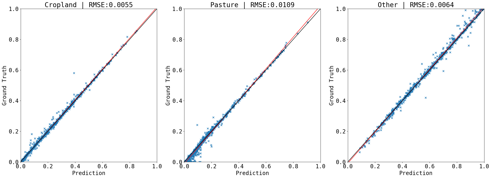 |  |


## Deployment and Bias Correction 
Since we are doing grid level prediction during deployment (20-by-20 kernel) and evaluation of output agland map on state level, the linkage between the two levels is unknown and unpresented to the model. Bias correction is an important step in the post-process that builds the missing bridge. We can see as iteration number increases, the output agland map converges to the input data. 

### *all_correct_to_FAO_scale_itr3_fr_0*
#### Order (top-down): Cropland, Pasture, Other
| iter 0                                                                                                                    | iter 1                                                                                                                    | iter 2                                                                                                                    | iter 3                                                                                                                    |
| ------------------------------------------------------------------------------------------------------------------------- | ------------------------------------------------------------------------------------------------------------------------- | ------------------------------------------------------------------------------------------------------------------------- | ------------------------------------------------------------------------------------------------------------------------- |
| 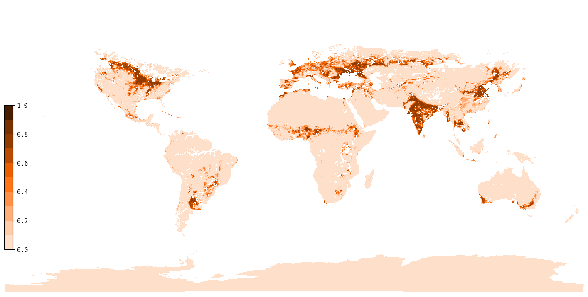 |  | 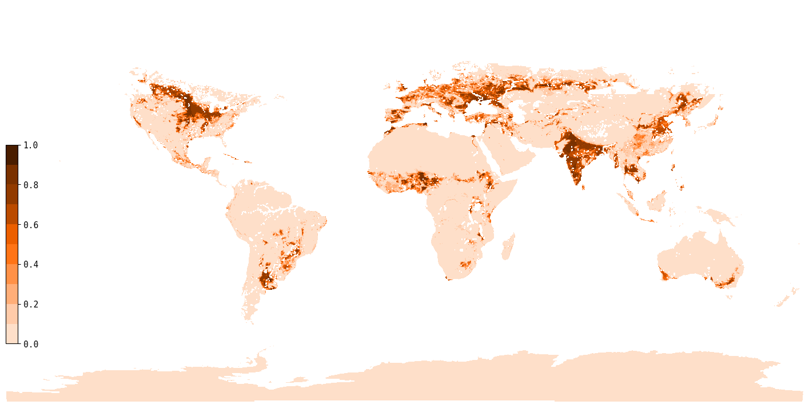 |  |
| 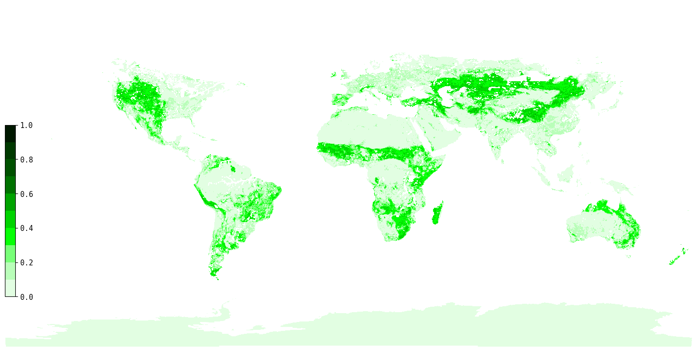   | 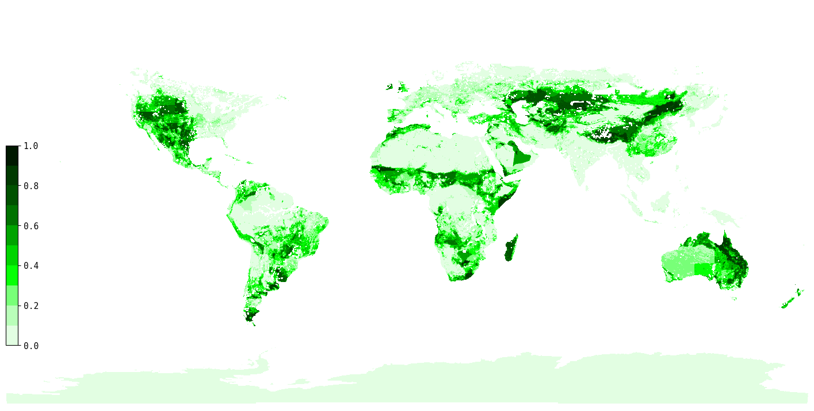   | 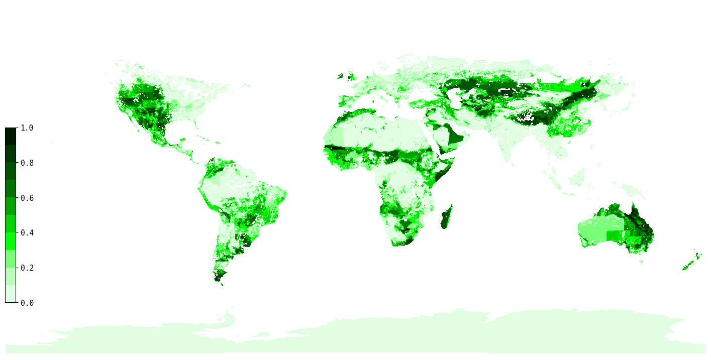   |    |
|        | 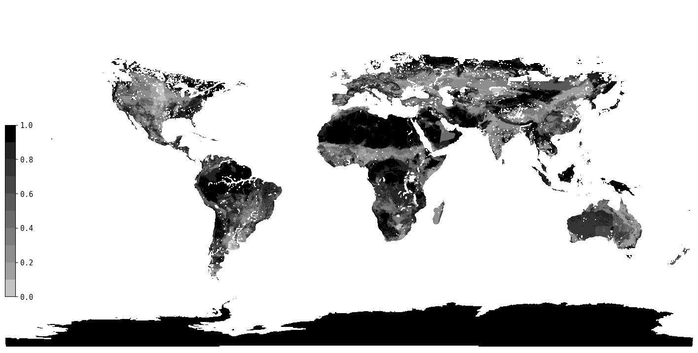       |        | 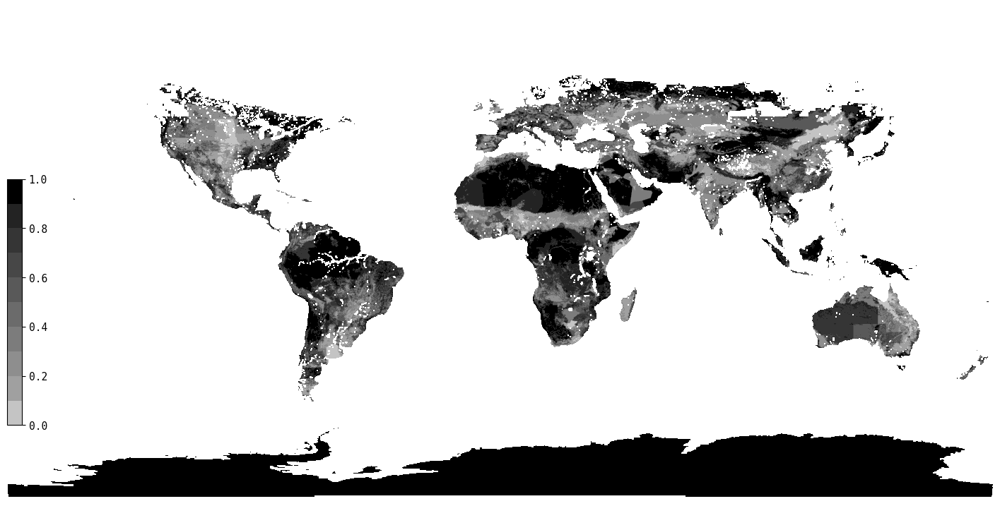       |


### *all_correct_to_subnation_scale_itr3_fr_0*
#### Order (top-down): Cropland, Pasture, Other
| iter 0                                                                                                                          | iter 1                                                                                                                          | iter 2                                                                                                                          | iter 3                                                                                                                          |
| ------------------------------------------------------------------------------------------------------------------------------- | ------------------------------------------------------------------------------------------------------------------------------- | ------------------------------------------------------------------------------------------------------------------------------- | ------------------------------------------------------------------------------------------------------------------------------- |
|  | 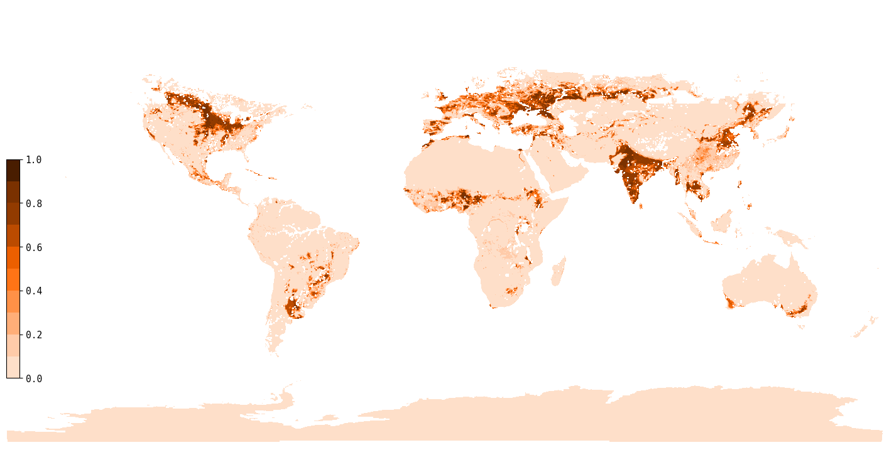 |  |  |
| 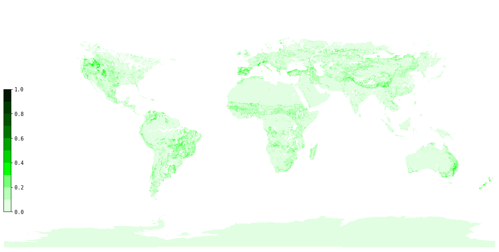   | 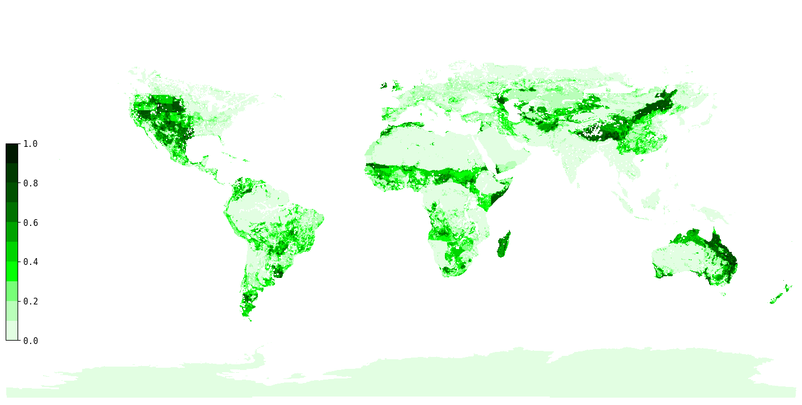   |    | 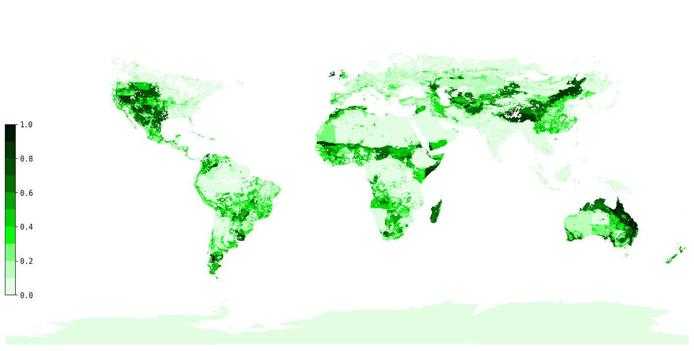   |
|        |        | 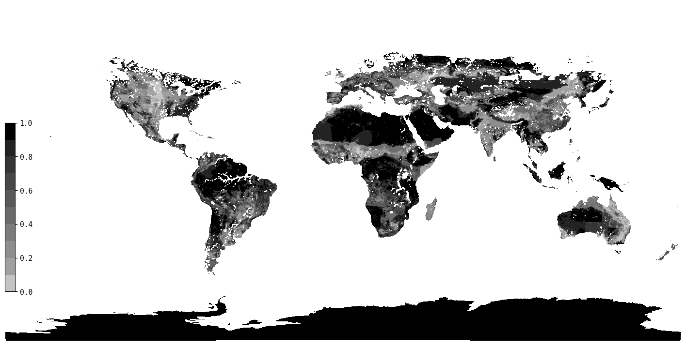       |        |


