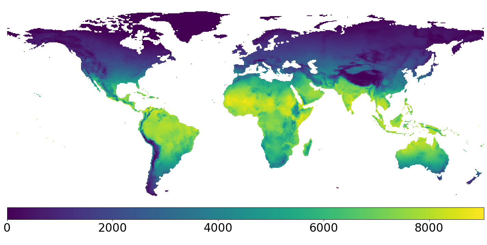

## Growing Degree Days (GDD)



GDD are used as a temperature-based indicator for plants growth and crop development. We generate a global mask based on GDD criteria to cover obviously non-agricultural regions from the train set. The above figure  shows a raw GDD map used in this project. 

To convert GDD from ``` adf ``` to ``` xyz ``` files for the project, first run:
```
batch_convert_adf_to_xyz.bat
```

## GDD Mask 


The GDD mask criteria used in this project follows the same approach as in [*Ramankutty et al. [2008]*](https://doi.org/10.1029/2007GB002952), where we remove all GDD values < 10000&deg;C in the north of 50&deg;N. The binary mask map is shown above. 

To modify the GDD mask criteria, one may directly re-define function [```gdd_crop_criteria()```](https://github.com/KaiTaiTong/global-agland-2015/blob/fbf6e13ef31729b8e47c2674e9fa25a18c9eb906/gdd/gdd_criteria.py#L8), and the changes will apply.