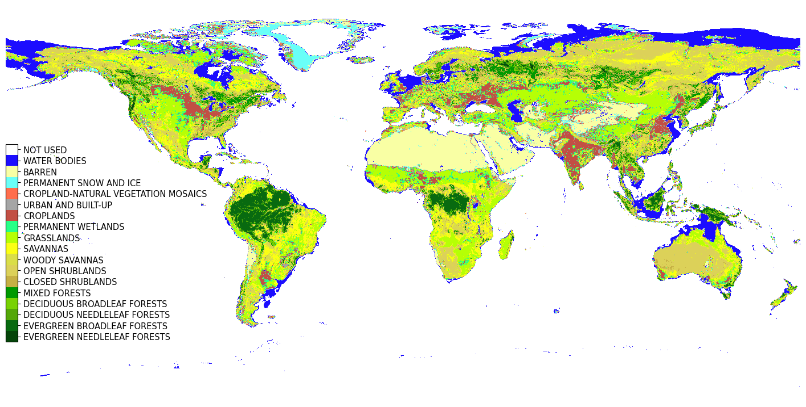

## Moderate Resolution Imaging Spectroradiometer (MODIS) Land Cover



MODIS land cover map is a GeoTIFF file that contains 17 land cover types. In this project, we choose to use [MCD12Q1](https://lpdaac.usgs.gov/products/mcd12q1v006/) product which has a resolution of 0.5km. Land cover type definition and indexing are set based on USGS [user guide](https://lpdaac.usgs.gov/documents/101/MCD12_User_Guide_V6.pdf) and could be found or modified in config file [land_cover_cfg.yaml](../configs/land_cover_cfg.yaml).

To convert the original MCD12Q1 product from sinusoidal coordinate system to EPSG:4326, we provide a [script](https://code.earthengine.google.com/c9df1a99efb410eb057264bed05f6578) in Google Earth Engine. After running the script, merge all raster layers in [QGIS3](https://qgis.org/en/site/) to get a single GeoTIFF file with size 43200 x 86400. The final MCD12Q1 land cover map is shown in the figure above. 

## Global Area Map


To get an estimation of area value of each pixel in standard EPSG:4326 coordinate system for the MCD12Q1 map, we prepare an R script to generate a global area map (in km^2). Simply run:
```
Rscript generate_global_area.R
```
The output GeoTIFF file shall look like the figure above (in km^2). 

## Prediction Input and Aggregation


Our model is trained on census samples but uses 20 x 20 block matrices as inputs for deployment. A histogram operator on a 20 x 20 kernel is implemented in [generate_land_cover_counts.py](./generate_land_cover_counts.py), with stride 20 to convolve over MCD12Q1 product, outputing a deploy-ready pkl file. Note that the script needs to be run on a Nvidia GPU using CUDA, which is ~350 times faster than CPU implementation. 

To run locally, do:
```
python -u generate_land_cover_counts.py --output_dir ./pred_input_map
```

To run on ComputeCanada, do:
```
sbatch sbatch_gen_files.sh
```
